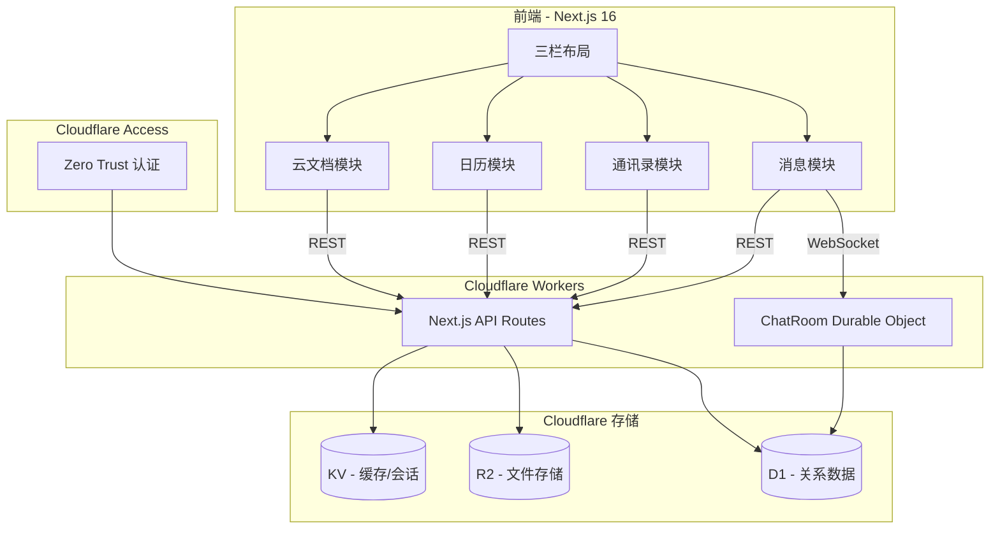
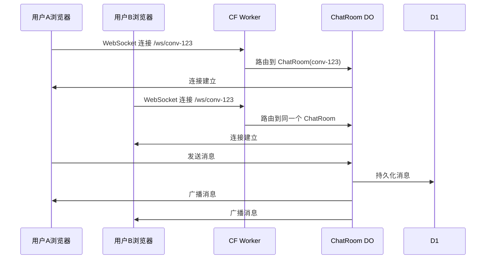

# Skylark - 类飞书即时通讯办公平台

## 整体架构



## 技术选型

- **前端框架**: Next.js 16 + React 19 + Tailwind CSS 4
- **部署**: OpenNext for Cloudflare
- **认证**: Cloudflare Access (Zero Trust)
- **关系数据**: Cloudflare D1 (用户、会话、消息、日历、文档元数据)
- **文件存储**: Cloudflare R2 (头像、聊天附件、文档文件)
- **实时通信**: Durable Objects + WebSocket (每个会话一个 DO 实例)
- **缓存**: Cloudflare KV (在线状态、未读计数)
- **图标**: Lucide React

## 项目目录结构

```
src/
├── app/
│   ├── layout.tsx              # 全局布局
│   ├── page.tsx                # 重定向到 /messages
│   ├── (workspace)/            # 主工作区布局组
│   │   ├── layout.tsx          # 三栏布局 (导航栏 | 列表 | 详情)
│   │   ├── messages/
│   │   │   ├── page.tsx        # 会话列表 + 聊天面板
│   │   │   └── [id]/page.tsx   # 具体会话
│   │   ├── contacts/
│   │   │   ├── page.tsx        # 通讯录
│   │   │   └── [id]/page.tsx   # 联系人详情
│   │   ├── calendar/
│   │   │   └── page.tsx        # 日历视图
│   │   └── docs/
│   │       ├── page.tsx        # 文档列表
│   │       └── [id]/page.tsx   # 文档编辑器
│   └── api/
│       ├── auth/
│       │   └── me/route.ts     # 当前用户信息
│       ├── conversations/
│       │   ├── route.ts        # 会话 CRUD
│       │   └── [id]/
│       │       ├── route.ts
│       │       └── messages/route.ts
│       ├── contacts/route.ts
│       ├── calendar/route.ts
│       ├── docs/route.ts
│       └── upload/route.ts     # R2 文件上传
├── components/
│   ├── layout/
│   │   ├── Sidebar.tsx         # 左侧导航栏
│   │   ├── ListPanel.tsx       # 中间列表面板
│   │   └── DetailPanel.tsx     # 右侧详情面板
│   ├── messages/
│   │   ├── ConversationList.tsx
│   │   ├── ChatView.tsx
│   │   ├── MessageBubble.tsx
│   │   └── MessageInput.tsx
│   ├── contacts/
│   │   ├── ContactList.tsx
│   │   └── ContactCard.tsx
│   ├── calendar/
│   │   ├── CalendarView.tsx
│   │   └── EventCard.tsx
│   └── docs/
│       ├── DocList.tsx
│       └── DocEditor.tsx
├── lib/
│   ├── db/
│   │   ├── schema.sql          # D1 建表语句
│   │   └── queries.ts          # 数据库查询封装
│   ├── r2.ts                   # R2 操作封装
│   ├── auth.ts                 # CF Access 认证工具
│   ├── websocket.ts            # WebSocket 客户端封装
│   └── types.ts                # TypeScript 类型定义
└── durable-objects/
    └── ChatRoom.ts             # 聊天室 Durable Object
```

## Wrangler 配置扩展

在现有 [wrangler.jsonc](wrangler.jsonc) 中添加 D1、R2、KV、Durable Objects 绑定：

```jsonc
{
  "d1_databases": [
    { "binding": "DB", "database_name": "skylark-db", "database_id": "..." }
  ],
  "r2_buckets": [
    { "binding": "R2", "bucket_name": "skylark-files" }
  ],
  "kv_namespaces": [
    { "binding": "KV", "id": "..." }
  ],
  "durable_objects": {
    "bindings": [
      { "name": "CHAT_ROOM", "class_name": "ChatRoom" }
    ]
  },
  "migrations": [
    { "tag": "v1", "new_sqlite_classes": ["ChatRoom"] }
  ]
}
```

## D1 数据库核心表

- **users** - 用户 (id, email, name, avatar_url, status)
- **conversations** - 会话 (id, type[direct/group], name, avatar_url)
- **conversation_members** - 会话成员 (conversation_id, user_id, role, last_read_at)
- **messages** - 消息 (id, conversation_id, sender_id, content, type[text/image/file], reply_to)
- **contacts** - 联系人 (user_id, contact_id, group_name)
- **calendar_events** - 日历事件 (id, title, start_time, end_time, creator_id)
- **calendar_attendees** - 事件参与者 (event_id, user_id, status)
- **documents** - 云文档 (id, title, content, type[doc/sheet], creator_id, r2_key)

## Durable Objects 实时通信设计

每个会话（conversation）对应一个 ChatRoom DO 实例，通过 `getByName(conversationId)` 路由：



## UI 设计要点

仿飞书三栏布局，主色调蓝色（#3370FF），深色侧边栏：

- **左侧导航栏** (64px)：图标导航，包含消息、通讯录、日历、云文档、工作台
- **中间列表面板** (280px)：会话列表 / 联系人列表 / 日历列表等
- **右侧详情面板** (flex-1)：聊天窗口 / 联系人详情 / 事件详情等

## 分阶段实施

### Phase 1：基础框架搭建
- 安装依赖（lucide-react 等）
- 创建 Wrangler 绑定配置（D1/R2/KV/DO）
- D1 数据库 Schema 和初始化脚本
- Cloudflare Access 认证中间件
- 三栏布局组件 + 左侧导航栏
- 类型定义（TypeScript）

### Phase 2：即时通讯核心
- 会话列表页（单聊、群聊）
- 聊天面板（消息气泡、时间分割线）
- 消息输入框（文本 + 文件上传到 R2）
- ChatRoom Durable Object（WebSocket 实时推送）
- WebSocket 客户端封装
- 消息 API Routes（CRUD + 分页加载）

### Phase 3：通讯录 + 日历
- 通讯录列表（按字母分组）
- 联系人详情卡片
- 添加/删除联系人
- 日历月视图组件
- 事件创建/编辑/删除
- 事件参与者管理

### Phase 4：云文档
- 文档列表页
- 富文本编辑器（基于 contentEditable 或轻量编辑器）
- 文档保存到 R2
- 文档元数据存 D1
