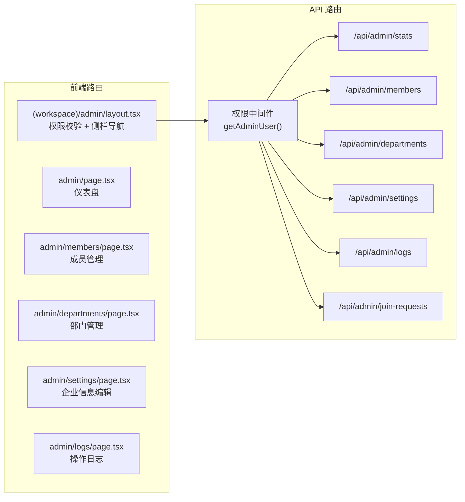

# 企业管理后台

## 整体架构



## 一、数据库扩展

在 [src/lib/db/schema.sql](src/lib/db/schema.sql) 新增 3 张表：

- **departments** — 部门表（`id`, `org_id`, `name`, `parent_id`, `created_at`）
- **join_requests** — 加入申请表（`id`, `org_id`, `user_id`, `message`, `status: pending/approved/rejected`, `reviewed_by`, `created_at`, `reviewed_at`）
- **admin_logs** — 操作日志表（`id`, `org_id`, `operator_id`, `action`, `target_type`, `target_id`, `detail`, `created_at`）

同时修改 `org_members` 表：给 `department` 字段改为引用 `departments.id`（可选，也可保持文本字段兼容现有数据）。

## 二、权限校验

在 [src/lib/auth.ts](src/lib/auth.ts) 新增 `getOrgRole()` 函数：
```typescript
export async function getOrgRole(db: D1Database, orgId: string, userId: string): Promise<OrgMemberRole | null>
```
API 路由中统一校验：只有 `role === 'owner'` 才放行，否则返回 403。

## 三、新增查询函数

在 [src/lib/db/queries.ts](src/lib/db/queries.ts) 新增：

- `updateOrganization(db, orgId, fields)` — 编辑企业信息（名称/描述/logo）
- `updateMemberRole(db, orgId, userId, newRole)` — 变更成员角色
- `removeMember(db, orgId, userId)` — 移除成员
- `getDepartments(db, orgId)` / `createDepartment` / `updateDepartment` / `deleteDepartment`
- `getJoinRequests(db, orgId)` / `createJoinRequest` / `reviewJoinRequest`
- `getAdminLogs(db, orgId, limit, offset)` / `createAdminLog`
- `getOrgStats(db, orgId)` — 聚合统计（成员数、消息量、活跃用户、文档数等）

## 四、API 路由（均校验 owner 权限）

| 路由 | 方法 | 功能 |
|------|------|------|
| `/api/admin/stats?org_id=` | GET | 仪表盘统计数据 |
| `/api/admin/members?org_id=` | GET | 成员列表（含部门筛选） |
| `/api/admin/members` | PUT | 变更角色 / 部门 |
| `/api/admin/members` | DELETE | 移除成员 |
| `/api/admin/departments?org_id=` | GET/POST | 部门列表 / 创建 |
| `/api/admin/departments/[id]` | PUT/DELETE | 编辑 / 删除部门 |
| `/api/admin/settings` | PUT | 编辑企业信息 |
| `/api/admin/join-requests?org_id=` | GET | 待审批列表 |
| `/api/admin/join-requests` | PUT | 审批（通过/拒绝） |
| `/api/admin/logs?org_id=` | GET | 操作日志（分页） |

## 五、前端页面

### 5.1 管理后台 Layout

`src/app/(workspace)/admin/layout.tsx` — 左侧管理导航栏 + owner 权限校验（非 owner 显示 403 页面）。导航项：仪表盘、成员管理、部门管理、企业设置、操作日志。

### 5.2 仪表盘（`admin/page.tsx`）

统计卡片：总成员数、本周新增成员、消息总量、活跃文档数、待审批申请数。趋势不需要图表，用数字 + 对比变化率即可。

### 5.3 成员管理（`admin/members/page.tsx`）

- 成员表格：头像、姓名、邮箱、部门、职位、角色、加入时间
- 操作：变更角色（下拉选择 admin/member）、修改部门/职位、移除成员
- 搜索筛选

### 5.4 部门管理（`admin/departments/page.tsx`）

- 部门列表：名称、成员数
- 操作：新建、编辑名称、删除（需确认）

### 5.5 企业设置（`admin/settings/page.tsx`）

- 企业名称、描述编辑表单
- 重新生成邀请码
- 开关：是否需要审批加入

### 5.6 操作日志（`admin/logs/page.tsx`）

- 时间线形式展示：操作人、操作类型、操作对象、时间
- 分页加载

### 5.7 Sidebar 入口

在 [src/components/layout/Sidebar.tsx](src/components/layout/Sidebar.tsx) 中：当前用户是 owner 时，在导航栏底部显示「管理后台」入口图标。需要在 `useOrg` 或 `useAuth` 中暴露当前用户在当前企业的角色。

## 六、加入审批流改造

修改现有 [src/app/api/orgs/join/route.ts](src/app/api/orgs/join/route.ts)：
- 如果企业开启了审批（`organizations` 表新增 `require_approval BOOLEAN DEFAULT 0`），则不直接加入，而是创建 `join_requests` 记录
- 管理后台审批通过后调用 `joinOrganization` 真正加入
