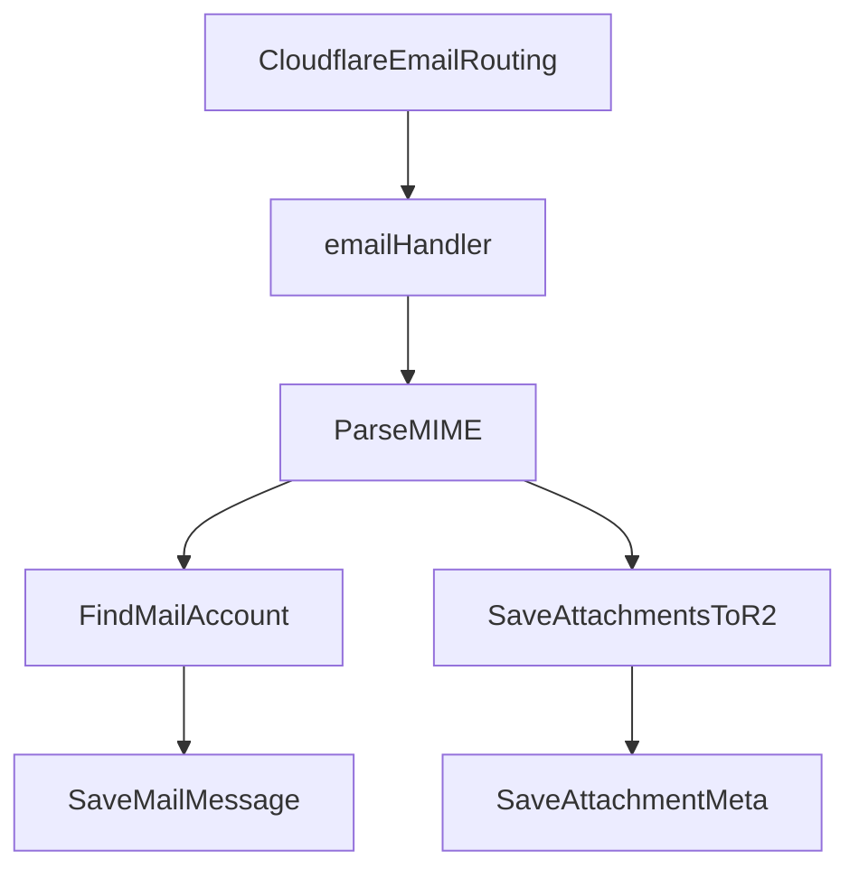

# 企业邮箱系统

## 实现目标

在现有 Next.js + OpenNext Cloudflare Worker 架构中，新增真实企业邮箱能力：

- 企业管理员配置邮箱域名和成员邮箱地址
- 用户在 `/mail` 使用企业邮箱收件、发件、草稿、已发送、归档/删除
- Cloudflare `email()` handler 接收外部来信并入库
- Cloudflare `send_email` binding 发送外部邮件
- 邮件附件存储到已有 R2 bucket `skylark-files`

Cloudflare 控制台/DNS 层面仍需管理员在域名上启用 Email Routing，并把对应地址路由到当前 Worker；代码侧提供域名/地址管理、收发信和存储逻辑。

## 核心文件

- [wrangler.jsonc](wrangler.jsonc)：新增 `send_email` binding，例如 `EMAIL`
- [worker-entry.ts](worker-entry.ts)：在现有 `fetch` handler 外新增 `email(message, env, ctx)`
- [cloudflare-env.d.ts](cloudflare-env.d.ts)：补充 `EMAIL: SendEmail` 等类型，后续可由 `wrangler types` 重新生成
- [src/lib/db/schema.sql](src/lib/db/schema.sql)：新增邮箱系统表
- [src/lib/types.ts](src/lib/types.ts)：新增邮箱相关类型与管理权限点
- [src/lib/db/queries.ts](src/lib/db/queries.ts)：新增邮箱查询/写入方法
- [src/app/api/mail/**](src/app/api/mail)：新增邮箱前台 API
- [src/app/api/admin/mail/**](src/app/api/admin/mail)：新增邮箱管理 API
- [src/app/(workspace)/mail/page.tsx](src/app/(workspace)/mail/page.tsx)：邮箱主界面
- [src/app/(workspace)/admin/mail/page.tsx](src/app/(workspace)/admin/mail/page.tsx)：企业邮箱管理页
- [src/components/layout/Sidebar.tsx](src/components/layout/Sidebar.tsx)：新增“邮箱”入口

## 数据模型

新增表：

- `mail_domains`：企业邮箱域名
  - `id`, `org_id`, `domain`, `status`, `routing_enabled`, `created_by`, `created_at`
- `mail_accounts`：企业邮箱账号
  - `id`, `org_id`, `user_id`, `domain_id`, `address`, `display_name`, `is_default`, `status`, `created_at`
- `mail_messages`：邮件主体元数据
  - `id`, `org_id`, `account_id`, `direction`, `folder`, `from_address`, `to_addresses`, `cc_addresses`, `bcc_addresses`, `subject`, `text_body`, `html_body`, `message_id`, `in_reply_to`, `sent_at`, `received_at`, `read_at`, `created_at`
- `mail_attachments`：附件元数据，文件仍落 R2
  - `id`, `message_id`, `file_name`, `file_size`, `mime_type`, `r2_key`, `content_id`, `created_at`
- `mail_recipients`：后续支持多收件人状态和内部投递
  - `message_id`, `address`, `type`, `delivery_status`

## Cloudflare 邮件接入

### 收信

在 [worker-entry.ts](worker-entry.ts) 增加 `email()` handler：

```typescript
async email(message, env, ctx) {
  ctx.waitUntil(handleIncomingEmail(message, env));
}
```

处理流程：



使用 `postal-mime` 解析 `message.raw`，按 `message.to` 匹配 `mail_accounts.address`，找不到账号则 `message.setReject("Mailbox not found")`。

### 发信

新增 `send_email` binding：

```jsonc
"send_email": [
  { "name": "EMAIL" }
]
```

前端调用 `POST /api/mail/send`，后端校验当前用户是否拥有发件邮箱账号，再调用：

```typescript
await env.EMAIL.send({
  to,
  cc,
  bcc,
  from: { email: account.address, name: account.display_name },
  subject,
  html,
  text,
  attachments,
});
```

发信成功后写入 `mail_messages(folder='sent', direction='outbound')`。

## API 设计

### 用户邮箱 API

- `GET /api/mail/accounts`：获取当前用户可用邮箱账号
- `GET /api/mail/messages?folder=inbox&page=1`：邮件列表
- `GET /api/mail/messages/:id`：邮件详情，包含附件
- `POST /api/mail/send`：发送邮件
- `POST /api/mail/messages/:id/read`：标记已读
- `POST /api/mail/messages/:id/move`：移动到归档/垃圾箱
- `DELETE /api/mail/messages/:id`：软删除

### 管理后台 API

- `GET /api/admin/mail/domains?org_id=`：域名列表
- `POST /api/admin/mail/domains`：新增企业邮箱域名
- `PATCH /api/admin/mail/domains/:id`：更新域名状态/说明
- `GET /api/admin/mail/accounts?org_id=`：邮箱账号列表
- `POST /api/admin/mail/accounts`：给成员分配邮箱地址
- `PATCH /api/admin/mail/accounts/:id`：禁用/启用账号

权限：在 `AdminPermission` 新增 `mail`，owner 默认拥有，admin 需要被授予“企业邮箱管理”。

## 前端页面

### `/mail` 邮箱工作台

三栏布局：

- 左侧：账号切换 + 文件夹（收件箱、已发送、草稿、归档、垃圾箱）
- 中间：邮件列表，支持未读、时间、发件人、主题预览
- 右侧：邮件详情 / 写信编辑器

一期先实现：列表、详情、写信、回复、附件上传/下载、标记已读、移动文件夹。

### `/admin/mail` 管理页

- 域名配置区：展示域名、状态、Cloudflare 路由配置提示
- 邮箱账号区：按成员分配 `localPart@domain`
- 管理员提示：Cloudflare Email Routing 地址需要在控制台绑定到 Worker

## 依赖与约束

新增依赖：

- `postal-mime`：解析入站 MIME 邮件

不引入独立 SMTP 服务；发信用 Cloudflare Email Service `send_email` binding。Cloudflare 侧要求企业域名已在账号内启用 Email Routing/Email Service，否则发信会因未验证域名失败。

## 验证方案

- TypeScript：`npx tsc --noEmit`
- 本地收信模拟：`wrangler dev` + `POST /cdn-cgi/handler/email` 测试原始邮件
- 发信绑定：本地默认模拟；需要真实发信时使用 `remote: true` 或部署 Worker 后测试
- 页面手测：创建域名、分配邮箱、发送邮件、接收邮件、附件下载
