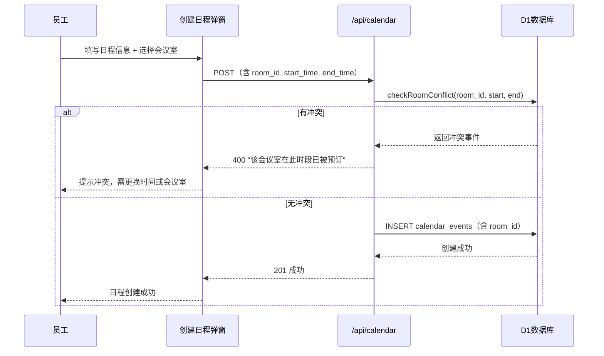

# 会议室管理功能

## 数据模型

### 新增表 `meeting_rooms`

```sql
CREATE TABLE IF NOT EXISTS meeting_rooms (
  id TEXT PRIMARY KEY,
  org_id TEXT NOT NULL,
  name TEXT NOT NULL,        -- 会议室名称，如"大会议室A"
  building TEXT NOT NULL,    -- 楼栋，如"A栋"
  floor TEXT,                -- 楼层，如"3F"
  room_number TEXT NOT NULL, -- 门牌号，如"A-301"
  capacity INTEGER DEFAULT 10,  -- 容纳人数
  facilities TEXT,           -- JSON: 设备列表如 ["投影仪","白板","视频会议"]
  status TEXT DEFAULT 'available' CHECK(status IN ('available','maintenance','disabled')),
  created_at DATETIME DEFAULT CURRENT_TIMESTAMP
);
```

### 扩展 `calendar_events` 表

通过 `ALTER TABLE` 添加 `room_id` 列（关联 `meeting_rooms.id`），同时在 `CalendarEvent` 类型中增加可选 `room_id` 和前端展示用的 `room?: MeetingRoom`。

## 核心冲突检测逻辑

预订会议室时，查询是否存在时间重叠的记录（标准区间重叠判断）：

```sql
SELECT id FROM calendar_events
WHERE room_id = ? AND id != ?  -- 排除自身（更新场景）
  AND start_time < ?           -- 已有事件开始时间 < 新事件结束时间
  AND end_time > ?             -- 已有事件结束时间 > 新事件开始时间
LIMIT 1
```

## 变更清单

### 1. 数据层

- [schema.sql](src/lib/db/schema.sql) -- 新增 `meeting_rooms` 表 + ALTER TABLE 给 `calendar_events` 加 `room_id`
- [types.ts](src/lib/types.ts) -- 新增 `MeetingRoom` 接口，扩展 `CalendarEvent` 加 `room_id` 和 `room?`
- [queries.ts](src/lib/db/queries.ts) -- 新增会议室 CRUD 函数 + `checkRoomConflict` 冲突检测 + 修改 `createCalendarEvent` / `getCalendarEvents` 关联会议室

### 2. API 路由

- 新增 `/api/admin/rooms` -- 管理员 CRUD 会议室（GET 列表、POST 创建、PUT 更新、DELETE 删除）
- 新增 `/api/rooms` -- 普通成员查看可用会议室列表（GET ?org_id=），支持 `?start=&end=` 查询特定时段空闲房间
- 修改 `/api/calendar` POST -- 支持 `room_id` 参数，创建时做冲突检测

### 3. 管理后台

- 新增 [/admin/rooms/page.tsx](src/app/(workspace)/admin/rooms/page.tsx) -- 会议室管理页面（增删改、楼栋/门牌号/容纳人数/设备配置）
- 修改 [admin/layout.tsx](src/app/(workspace)/admin/layout.tsx) -- 导航栏添加"会议室管理"入口

### 4. 日历前端

- 新增 `RoomPicker` 组件 -- 选择会议室的弹窗/下拉，展示各会议室在选定时段的占用状态
- 修改 [CalendarView.tsx](src/components/calendar/CalendarView.tsx) -- "新建日程"按钮绑定创建流程
- 新增 `CreateEventModal` 组件 -- 创建日程弹窗，集成标题、时间、参与人、**会议室选择**，提交时后端校验冲突
- 修改 [EventCard.tsx](src/components/calendar/EventCard.tsx) -- 展示已预订的会议室信息（楼栋+门牌号）
- 修改 [calendar/page.tsx](src/app/(workspace)/calendar/page.tsx) -- 集成创建/编辑弹窗

## 交互流程


