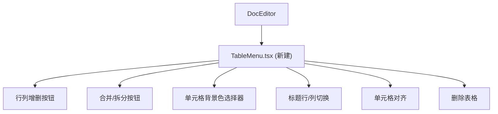

# 改进文档表格系统

## 现状分析

当前表格实现：
- [DocEditor.tsx](src/components/docs/DocEditor.tsx) 注册了 `Table.configure({ resizable: true })`, `TableRow`, `TableHeader`, `TableCell`
- [EditorToolbar.tsx](src/components/docs/editor/EditorToolbar.tsx) 仅有一个"插入 3x3 表格"按钮
- [styles.css](src/components/docs/editor/styles.css) 有基础表格边框/表头/选中单元格样式
- 没有任何表格内部操作的 UI 入口（无法增删行列、合并拆分、设背景色等）

TipTap `@tiptap/extension-table` 已内置以下命令，只需构建 UI：
- `addRowBefore/After`, `deleteRow`, `addColumnBefore/After`, `deleteColumn`
- `mergeCells`, `splitCell`
- `toggleHeaderRow`, `toggleHeaderColumn`, `toggleHeaderCell`
- `deleteTable`, `setCellAttribute`

## 需要实现的协作文档表格功能

1. **表格浮动工具栏** -- 光标在表格内时，在表格上方显示操作栏
2. **行列增删** -- 在上/下方插入行、在左/右侧插入列、删除行/列
3. **合并/拆分单元格** -- 选中多个单元格后合并，合并后可拆分
4. **单元格背景色** -- 选中单元格/行/列后设置背景颜色
5. **标题行/列切换** -- 切换表头行/表头列的样式
6. **对齐单元格内容** -- 单元格内的文本对齐（左/中/右）
7. **删除整个表格**
8. **增强的 CSS 样式** -- 标题列样式、背景色渲染、hover 效果

## 组件架构

核心只需新建一个文件 + 修改 3 个已有文件：

## 实施内容

### 1. 新建 `TableMenu.tsx`

路径：`src/components/docs/editor/TableMenu.tsx`

当 editor 光标处于 table 内时，在表格正上方渲染一行浮动操作栏，按钮分组：

- **行列操作**：上方插入行 / 下方插入行 / 删除行 | 左侧插入列 / 右侧插入列 / 删除列
- **合并/拆分**：合并单元格（选中多个时可用）/ 拆分单元格（已合并时可用）
- **背景色**：8 色调色盘（复用 EditorToolbar 的颜色预设），调用 `setCellAttribute('backgroundColor', color)`
- **标题切换**：切换标题行 / 切换标题列
- **对齐**：左 / 中 / 右对齐（通过 TextAlign 扩展作用于单元格内段落）
- **删除表格**

检测逻辑：通过 `editor.isActive('table')` 判断是否显示，位置使用 `editor.view.coordsAtPos()` 计算。

### 2. 修改 `DocEditor.tsx`

- 导入并渲染 `TableMenu` 组件
- 传入 `editor` prop

### 3. 修改 `styles.css`

新增样式：
- **单元格背景色**：`td[data-background]`, `th[data-background]` 使用 `style` 属性
- **标题列样式**：`th` 在首列时的样式（目前只有表头行样式）
- **表格 hover 效果**：行 hover 时轻微高亮
- **表格操作栏样式**：浮动工具栏定位和外观

### 4. 修改 `EditorToolbar.tsx`

将当前的单一"插入表格"按钮增强为带下拉菜单的按钮，可选择不同尺寸（2x2 / 3x3 / 4x4）。
