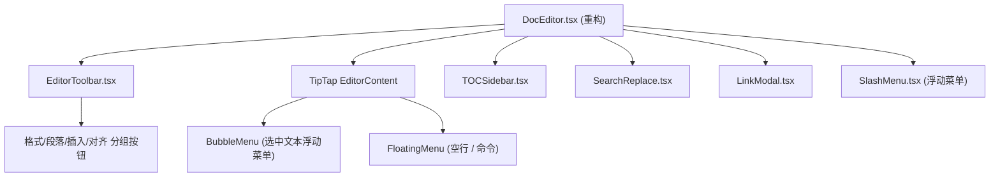

# 飞书级文档系统构建

## 1. 依赖安装

```bash
npm install @tiptap/react @tiptap/pm @tiptap/starter-kit \
  @tiptap/extension-underline @tiptap/extension-text-align \
  @tiptap/extension-text-style @tiptap/extension-highlight \
  @tiptap/extension-link @tiptap/extension-image \
  @tiptap/extension-placeholder @tiptap/extension-table \
  @tiptap/extension-list
```

- `@tiptap/starter-kit` 已包含：heading, bold, italic, strike, code, blockquote, bullet-list, ordered-list, code-block, horizontal-rule, hard-break, undo/redo
- `@tiptap/extension-list` 统一管理 task-list / task-item

## 2. 数据格式兼容

当前 DB 存储 HTML (`documents.content TEXT`)。TipTap 原生支持 HTML 输入/输出，**不改数据库 schema**，继续存储 HTML：
- 读取时：`editor.commands.setContent(htmlString)` 
- 保存时：`editor.getHTML()`
- 向后兼容：已有文档内容无需迁移

## 3. 组件架构



所有编辑器子组件放在 `src/components/docs/editor/` 目录下。

## 4. 功能模块对照

### 4.1 文档工具栏 ([EditorToolbar.tsx](src/components/docs/editor/EditorToolbar.tsx))

分组按钮布局（参考飞书工具栏）：

- **撤销/重做**: undo, redo
- **文本格式**: 加粗, 斜体, 下划线, 删除线, 行内代码, 文字颜色, 高亮背景色
- **段落格式**: H1-H4, 正文, 引用
- **列表**: 无序列表, 有序列表, 任务列表
- **对齐**: 左对齐, 居中, 右对齐
- **缩进**: 增加缩进, 减少缩进
- **插入**: 超链接, 图片, 分割线, 代码块, 表格, 分栏
- **模式**: 阅读模式切换

工具栏按钮需反映当前光标处的激活状态（如光标在粗体文字上，加粗按钮高亮）。

### 4.2 阅读模式

- 顶栏增加「编辑/阅读」模式切换按钮
- 切换时调用 `editor.setEditable(bool)`
- 阅读模式下隐藏工具栏，仅显示内容区域
- 内容区域样式保持一致

### 4.3 查找和替换 ([SearchReplace.tsx](src/components/docs/editor/SearchReplace.tsx))

- 快捷键 `Ctrl/Cmd + F` 打开查找面板，`Ctrl/Cmd + H` 打开替换面板
- 使用 ProseMirror `Decoration` 高亮匹配文本
- 支持：上一个/下一个匹配、全部替换、匹配计数显示
- 面板位于编辑器右上角浮动显示

### 4.4 章节标题与目录 ([TOCSidebar.tsx](src/components/docs/editor/TOCSidebar.tsx))

- 支持 H1-H4 四级标题
- 右侧自动生成目录大纲，从编辑器内容实时解析 heading 节点
- 点击目录项滚动到对应位置
- 当前可视区域的标题高亮
- 可折叠收起

### 4.5 内容块 / Slash 命令 ([SlashMenu.tsx](src/components/docs/editor/SlashMenu.tsx))

在空行输入 `/` 弹出命令面板，可插入：
- H1-H4 标题
- 无序/有序/任务列表
- 引用块
- 代码块
- 分割线
- 信息提示块（自定义 Callout node：info/warning/success/error 四种样式）
- 表格
- 图片
- 分栏布局

自定义 TipTap Extension：
- **Callout Node** (`src/components/docs/editor/extensions/callout.ts`): 带图标的提示块
- **Column Layout Node** (`src/components/docs/editor/extensions/columns.ts`): 2/3 列并排布局

### 4.6 超链接 ([LinkModal.tsx](src/components/docs/editor/LinkModal.tsx))

- 使用 `@tiptap/extension-link` 
- 工具栏插入链接按钮弹出 modal：输入 URL + 文字
- 选中文本时通过 BubbleMenu 显示编辑/取消链接
- 支持 Markdown 语法 `[text](url)` 快捷输入
- 链接可点击在新窗口打开

### 4.7 分栏功能 (自定义 Extension)

- 自定义 `columns` / `column` ProseMirror node
- 支持 2 列 / 3 列布局
- 通过 Slash 命令或工具栏插入
- 每列可独立编辑内容

### 4.8 缩进和对齐

- `@tiptap/extension-text-align`: 左/中/右对齐
- Tab / Shift+Tab 控制列表缩进
- 工具栏按钮 indent / outdent

### 4.9 引用

- StarterKit 自带 blockquote
- 样式：左侧蓝色竖线 + 灰色背景
- 支持 `>` Markdown 快捷输入

### 4.10 Markdown 快捷输入

TipTap StarterKit 内置 Input Rules：
- `# ` → H1, `## ` → H2, `### ` → H3
- `**text**` → 加粗, `*text*` → 斜体
- `- ` / `* ` → 无序列表, `1. ` → 有序列表
- `` `code` `` → 行内代码, ```` ``` ```` → 代码块
- `> ` → 引用
- `---` → 分割线
- `[ ] ` → 任务列表（来自 @tiptap/extension-list）

### 4.11 BubbleMenu (选中文本浮动菜单)

选中文本时浮动显示常用格式按钮：
- 加粗 / 斜体 / 下划线 / 删除线 / 代码 / 链接 / 高亮 / 文字颜色

## 5. 需要修改的文件

| 文件 | 操作 |
|------|------|
| `package.json` | 添加 TipTap 依赖 |
| `src/components/docs/DocEditor.tsx` | 完全重构为 TipTap 编辑器 |
| `src/app/(workspace)/docs/[id]/page.tsx` | 改用新 DocEditor 组件 |
| `src/components/docs/editor/EditorToolbar.tsx` | 新建 - 完整工具栏 |
| `src/components/docs/editor/TOCSidebar.tsx` | 新建 - 目录大纲 |
| `src/components/docs/editor/SearchReplace.tsx` | 新建 - 查找替换 |
| `src/components/docs/editor/LinkModal.tsx` | 新建 - 链接编辑弹窗 |
| `src/components/docs/editor/SlashMenu.tsx` | 新建 - 斜杠命令菜单 |
| `src/components/docs/editor/BubbleToolbar.tsx` | 新建 - 选中文本浮动菜单 |
| `src/components/docs/editor/extensions/callout.ts` | 新建 - 提示块扩展 |
| `src/components/docs/editor/extensions/columns.ts` | 新建 - 分栏布局扩展 |
| `src/components/docs/editor/styles.css` | 新建 - 编辑器样式 |

## 6. 实施顺序

按依赖关系分阶段实施，每阶段完成后都是可用状态：

- **阶段 1**: 安装依赖 + 核心编辑器重构（TipTap 替换 contentEditable + 基础工具栏 + 样式）
- **阶段 2**: BubbleMenu + SlashMenu + Markdown 快捷输入
- **阶段 3**: 超链接 Modal + 图片插入
- **阶段 4**: 查找替换面板
- **阶段 5**: 目录大纲 + 阅读模式
- **阶段 6**: 自定义扩展（Callout 内容块 + 分栏布局）+ 表格
- **阶段 7**: 更新独立文档页面 `docs/[id]/page.tsx` + lint 检查